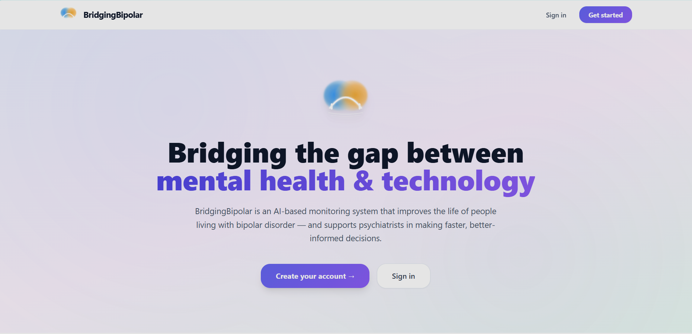
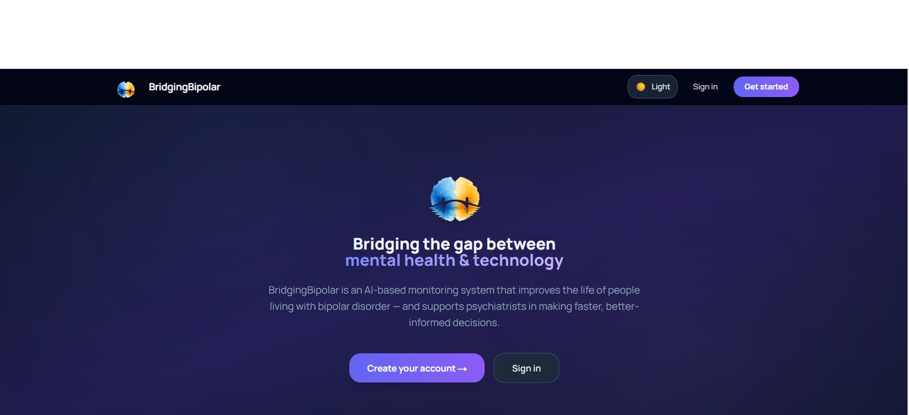
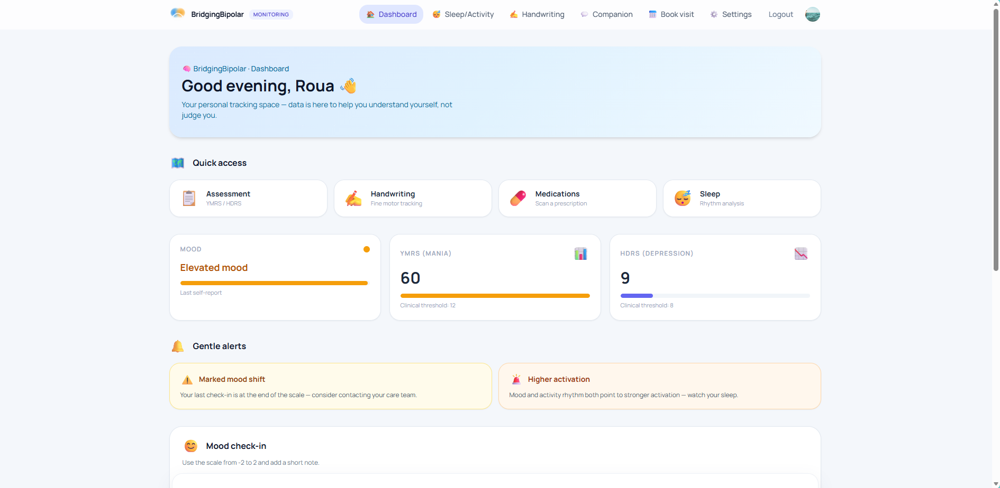
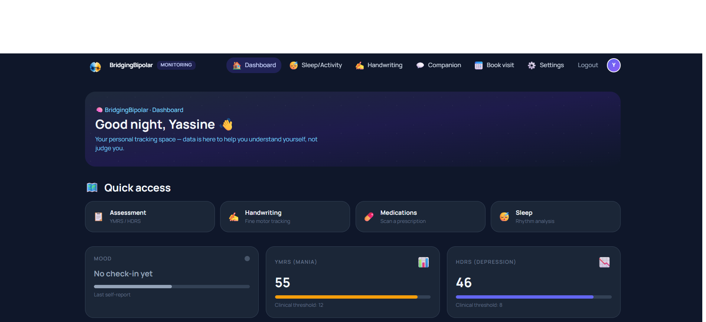
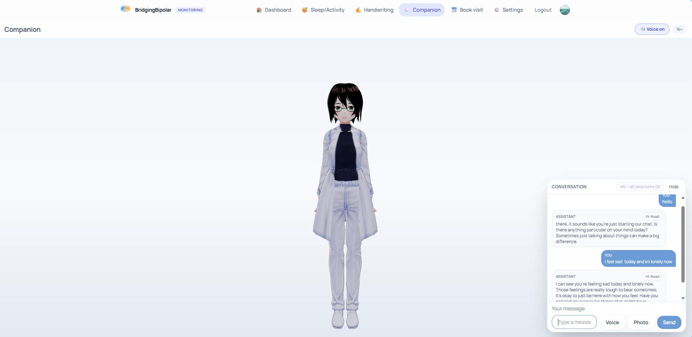
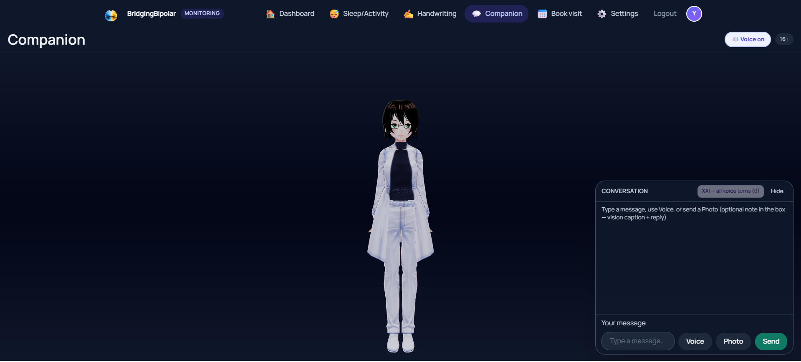
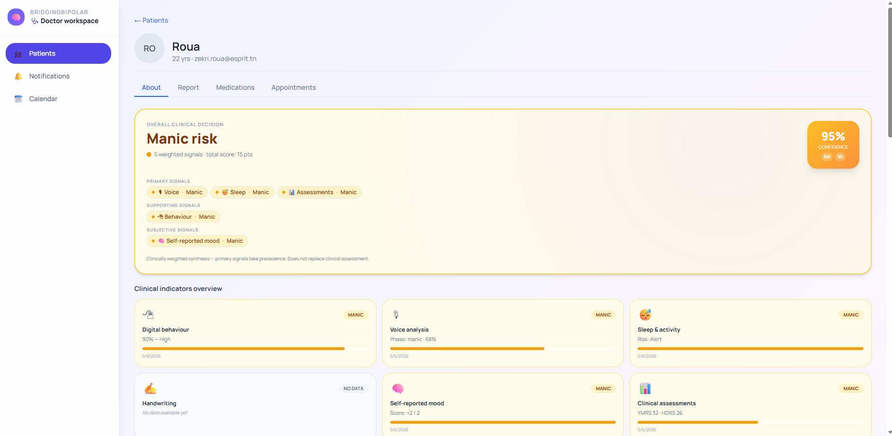
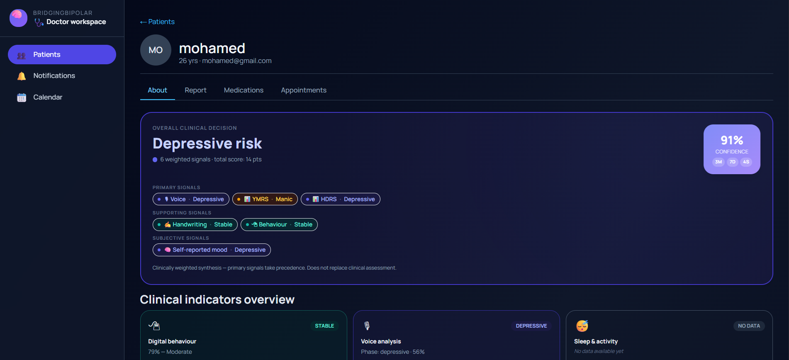
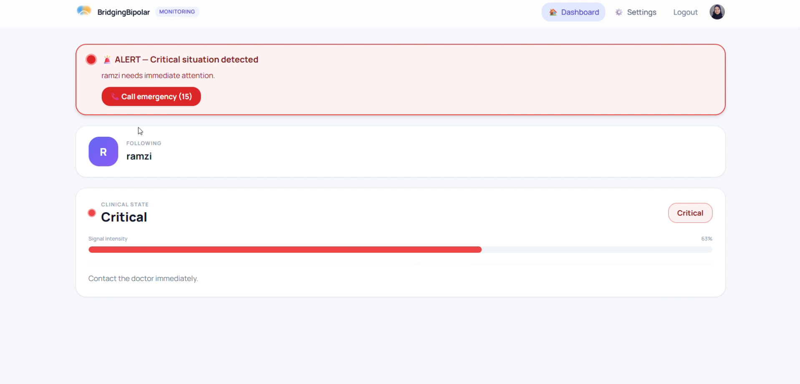
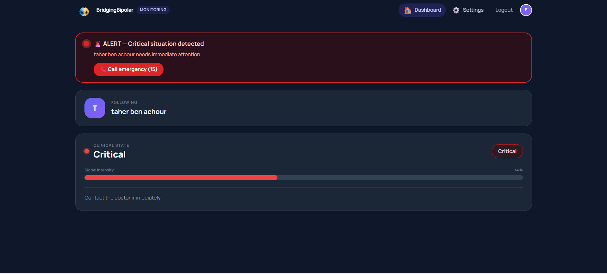

# Démo BridgingBipolar

Supports visuels pour la publication ESPRIT.

## Captures d'écran (`screenshots/`)

Parcours recommandé pour la soutenance : **01 → 03 → 05 → 07 → 09**.

### 01 — Page d'accueil (mode clair)

### 02 — Page d'accueil (mode sombre)

### 03 — Dashboard patient (mode clair)

### 04 — Dashboard patient (mode sombre)

### 05 — Companion IA (mode clair)

### 06 — Companion IA (mode sombre)

### 07 — Espace médecin — risque maniaque

### 08 — Espace médecin — risque dépressif (mode sombre)

### 09 — Alerte critique (mode clair)

### 10 — Alerte critique (mode sombre)

## Vidéo

**Lien démo :** https://youtu.be/jfptvoVh6F4

## Déploiement (optionnel)
