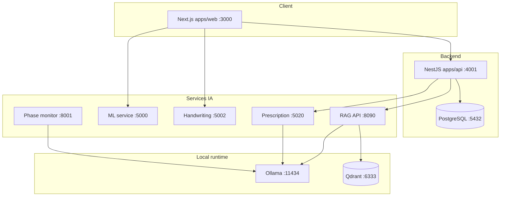

# Architecture

## Vue d'ensemble

## Rôles

| Composant | Responsabilité |
|-----------|----------------|
| **apps/web** | UI patient, médecin, companion 3D, onboarding HDRS/YMRS |
| **apps/api** | Auth JWT, patients, médecins, activités, chat proxy, uploads |
| **rag_api** | GraphRAG, companion texte/photo/voix, embeddings Qdrant |
| **apps/ml-service** | Rapports sommeil/activité (Excel / features) |
| **apps/handwriting-api** | Détection changements écriture manuscrite |
| **apps/prescription-service** | OCR + extraction médicaments (EasyOCR + Ollama) |
| **integration_kh** | Analyse phase vocale (bipolar phase monitor) |

## Flux données patient

1. Check-in quotidien → `activityLogs` + `moodEntries` (Postgres)
2. Voix / écriture / Excel → logs structurés dans `activityNotes` ou services dédiés
3. Médecin → synthèse multimodale + rapport hebdomadaire visuel (API `doctor/patients/:id`)

## Base de données

Schéma Prisma : `apps/api/prisma/schema.prisma`  
Migrations : `apps/api/prisma/migrations/`

Entités principales : `User`, `MoodEntry`, `ActivityLog`, `Assessment`, `Medication`, `Appointment`, `CompanionMessage`.
